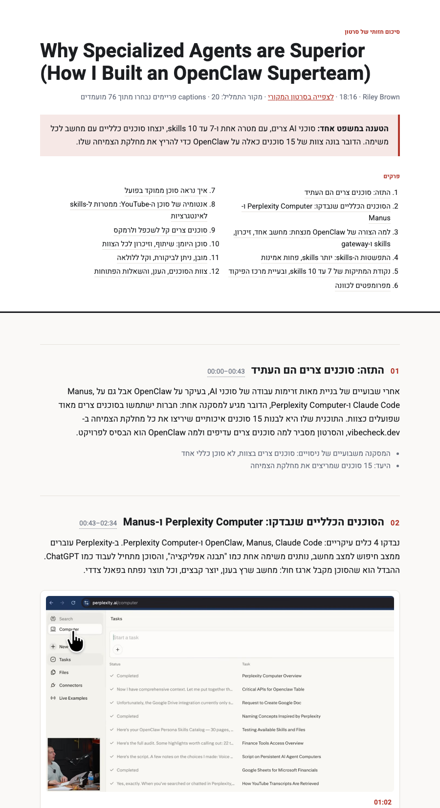

# Visual Video Summarizer

[](https://github.com/yosishe/visual-video-summarizer/actions/workflows/ci.yml)
[](LICENSE)

**Turn lectures, tutorials, and demos into clear takeaways and illustrated study notes—with timestamps back to the source.**

Give `/summarize-video` a YouTube URL or a local recording. It creates a concise opening summary, main points and takeaways, then detailed chapters with original video frames beside the explanations they support. Open the result as a single HTML file; add PDF when you need a printable copy. Hebrew with RTL layout is the default; use `--lang en` for English.

Built for learners who need to understand an argument **and** see the slide, code, diagram, or demonstration behind it. Best with clear speech and useful on-screen material. It needs a transcript; a silent video or inaccessible source cannot produce a grounded lecture summary.

[Get started](#get-started) · [See the output](#what-you-get) · [Data and permissions](SECURITY.md) · [Benchmarks](bench/README.md) · [Report a vulnerability privately](https://github.com/yosishe/visual-video-summarizer/security/advisories/new)

## What you get

- **A brief to read first:** a short synthesis, essential points, and supported takeaways. Usually 150–250 words, shorter when appropriate, with source timestamps.
- **Detailed illustrated chapters:** explanations from the transcript, chapter key points, and selected original frames with captions explaining their relevance.
- **Traceable evidence:** text cites transcript segments; frame timestamps come from decoded video; selected frames are checked against the pixels the model reviewed.
- **Portable output:** `summary-ID.html` embeds its images and font. `--pdf` adds `summary-ID.pdf`. The editable `summary-ID/` directory keeps `index.html`, `assets/`, and the evidence manifest.

The screenshot below shows the illustrated chapter layout from an earlier Hebrew screencast run. Current output also includes the opening brief described above.



The brief preserves the speaker's reasoning, exceptions, and qualifications. It is written after the detailed chapters and checked against its cited segments. The audit catches specific grounding errors; it cannot prove that every explanation is correct or complete.

## Get started

This is an **agent skill**, not a standalone automatic summarization service. The documented invocation is for Claude Code. Other Agent Skills hosts need local shell, file and image tools; their integration has not been tested here. An agent/model account is separate from this repository.

### 1. Review and install

Read [SKILL.md](SKILL.md), [SECURITY.md](SECURITY.md), and the [scripts](scripts/) before enabling the skill. The clone below does not run an installer or enable a background service. Use a new destination; do not overwrite an existing installation.

```bash
git clone https://github.com/yosishe/visual-video-summarizer.git ~/.claude/skills/summarize-video
cd ~/.claude/skills/summarize-video
git rev-parse HEAD
```

For reproducible installations, review a particular commit in GitHub and check out that full commit ID with `git checkout --detach <reviewed-commit>`. Update only after reviewing the incoming changes; the skill never updates itself. See [update and removal guidance](SECURITY.md#updates-and-removal).

### 2. Check your tools

Required: **Python 3.10+, ffmpeg/ffprobe, and a current yt-dlp** for URLs. Local recordings do not need yt-dlp. The core Python scripts use the standard library; optional enhancements are listed below.

```bash
python3 scripts/doctor.py
# Machine-readable readiness, including an installed PDF engine:
python3 scripts/doctor.py --pdf --json
```

The doctor checks installed executable versions and config-file metadata. It does not install packages, read keys, download a video, or upload audio. A successful check confirms prerequisites, not that a particular remote video is accessible.

If dependencies are missing, install them yourself through a package manager you trust. For example, on macOS with Homebrew already installed:

```bash
brew install python ffmpeg yt-dlp
```

On Linux, use your distribution's packages for Python and ffmpeg and the [official yt-dlp installation instructions](https://github.com/yt-dlp/yt-dlp#installation). YouTube extraction may also need the supported JavaScript runtime/components described by yt-dlp. This skill disables remote component downloads and ambient yt-dlp configuration; install necessary components explicitly.

### 3. Make your first summary

In a Claude Code session, choose a public video you may process:

```text
/summarize-video https://www.youtube.com/watch?v=VIDEO_ID --lang en
/summarize-video https://www.youtube.com/watch?v=VIDEO_ID --lang he --tier high --pdf
```

Use a short, captioned lecture first. No Groq/OpenAI transcription key is needed when captions are available. The agent writes the summary into the current task directory and reports the HTML path. Opening the bundled HTML requires no server or PDF engine.

**Before using private material:** the agent's model provider processes the transcript and the images the agent reads under that provider's settings. Local frame extraction does not make a hosted agent offline. Downloading a URL contacts the source platform and its delivery infrastructure. Audio transcription upload is **off by default**, even when a key exists. [Full data-flow and permission details](SECURITY.md#data-flow).

### Videos without captions and local recordings

The built-in fallback uploads extracted audio to the provider you explicitly select:

```text
/summarize-video /absolute/path/to/lecture.mp4 --lang en --whisper groq
/summarize-video https://www.youtube.com/watch?v=VIDEO_ID --whisper openai
```

Only choose one after accepting that provider's audio processing and any charges. Configure its matching `GROQ_API_KEY` or `OPENAI_API_KEY` in your environment or in `~/.config/summarize-video/.env` (owner-only permissions, `chmod 600`). Do not paste keys into the agent conversation. The skill does not read another skill's credentials or a project's `.env`.

`--no-whisper` disables this fallback and takes precedence if both flags are supplied. Without captions or authorized transcription, the pipeline stops with exit 6; it does not invent a frames-only transcript. Existing installations that relied on automatic upload must now select a provider explicitly.

## How it works

```text
transcript → chapters and visual targets → contact sheets → verified shortlist
           → selected original frames → detailed prose and opening brief
           → evidence audit → HTML and optional PDF
```

Text planning happens before image review. Targets reference transcript segment IDs; the engine derives search windows, decoded timestamps, and chapter placement. Scene detection also scans chapters for useful visuals the transcript did not predict. Blank and duplicate candidates are filtered before image review. The model reads the contact sheets once and the verified shortlist once; the selected output frames are re-decoded and checked against those candidates.

The brief adds a quick way into the existing detailed summary. It does not replace chapters or increase their coverage score. Old summaries without a `brief` remain valid. See [the JSON contracts](references/contracts.md) for schemas and [SKILL.md](SKILL.md) for the full workflow.

### Hebrew and English

The model writes directly from the transcript in the requested language. Manual/original caption tracks are preferred, with untranslated automatic captions used when needed; automatic captions can contain errors. The audit checks numbers, identifiers, URLs, cited segment ranges and Hebrew text hygiene, with review notices for some uncertain matches.

The page uses logical CSS and `dir="rtl"` for Hebrew, isolates timestamps and English/code runs, and embeds the Heebo subset under the SIL OFL. PDF export uses an already installed Chrome or WeasyPrint. Neither the skill nor the exporter installs a PDF engine.

### Quality, cost, and optional tools

| Choice | Behavior |
|---|---|
| `--tier standard` | Default, smaller candidate pool and image budget |
| `--tier high` | Denser sampling, adaptive scene threshold, verified sharpness refinement; more CPU and a larger image budget |
| Image budget | Default 12,000 tokens for standard / 20,000 for high; contact sheets and shortlist are sized before reading |
| Long videos | Over 120 minutes requires explicit `--allow-long`; `--sections` can limit extraction |
| `Pillow` | Optional faster box filtering; required for the test suite |
| `opencv-python-headless` | Optional face demotion in high tier |
| ffmpeg OCR support | Optional slide-ranking signal; candidate metadata may retain an OCR excerpt, not just a count |
| Chrome or WeasyPrint | Optional, for PDF export only |

Image token estimates use the project's documented Claude sizing formula; other providers and models can differ. Text/model charges and cloud transcription charges are separate. Budgets limit this workflow's planned image reads, not every action a host agent could take. Reproducible measurements, draft annotation status, and limits are in [bench/README.md](bench/README.md).

## Security you can inspect

The repository adds no telemetry, background service, auto-updater, or permission bypass. Its safeguards include explicit audio-upload selection, fixed transcription endpoints with redirects blocked, isolated yt-dlp options, constrained image paths, hashing of the actual rendered assets, escaped static HTML, a restrictive browser content policy, and regression tests with synthetic secrets and files.

**These are scoped controls, not a sandbox or a security certification.** The host agent, installed tools, model provider, and media decoders remain part of the trust boundary. Source speech, captions, metadata and OCR are untrusted content, never permission to execute instructions. [SECURITY.md](SECURITY.md) maps these claims to code/tests, describes data retention and residual risks, and provides private reporting.

## Troubleshooting

| Symptom | Next step |
|---|---|
| Doctor reports a missing or incompatible dependency | Install/update that tool explicitly, then rerun the doctor. |
| YouTube HTTP 403 / PO Token / JavaScript challenge error | Check current yt-dlp requirements and source access restrictions. Updating alone may not fix every video. Cookies/logins and remote component downloads are not enabled automatically. |
| No transcript / exit 6 | Choose a captioned source, or explicitly authorize a configured `--whisper` provider. Local files use the same opt-in fallback. |
| Unresolved chapter/target or audit failure | Correct the cited segments or frame selection. Inspect the report; do not bypass the audit to claim completion. |
| PDF unavailable / exit 4 | Open the HTML. Install a PDF engine yourself if you need PDF. |
| Faces or OCR unavailable | Optional signal absent; other extraction and verification stages still run. |
| Unsafe asset or active HTML rejected | Regenerate from the validated summary and original frames. Do not bundle an arbitrary web page. |

## Standalone scripts and development

The agent authors chapters, selections, and prose between deterministic script stages. The commands below are **not** an automatic one-command summarizer:

```bash
python3 scripts/transcript.py "<url-or-path>" --work WORK
# Author WORK/chapters.json with visual targets referencing transcript segments.
python3 scripts/candidates.py "<url-or-path>" --work WORK --transcript WORK/transcript.json --chapters WORK/chapters.json
# Review contact sheets and the verified shortlist; author WORK/selections.json.
python3 scripts/grab.py --work WORK --spec WORK/selections.json --out-dir summary-ID/assets
# Author WORK/summary.json with detailed chapters, then the opening brief.
python3 scripts/render.py --work WORK --summary WORK/summary.json --selections WORK/selections.json --assets-dir summary-ID/assets --out-dir summary-ID
```

Each script provides `--help`. Caption/audio opt-in flags belong to `transcript.py`; quality/budget flags to `candidates.py`; PDF flags to `render.py`. See [contracts](references/contracts.md), [benchmark instructions](bench/README.md), and [changelog](CHANGELOG.md).

Tests synthesize media fixtures locally, need ffmpeg and Pillow, and run in GitHub CI on Python 3.11 and 3.12:

```bash
python3 -m compileall -q scripts tests
python3 -m unittest discover -s tests -v
```

Contributions are welcome: include a reproducible case and a focused test where appropriate. For visual or language changes, include a before/after output example. Use the private reporting route for vulnerabilities; never attach API keys or private recordings to a public issue.

## Credits and license

Maintained by **yosishe**, with pipeline and review contributions from **OpenAI Codex** and **Claude Code**. Frame-engine internals and the original Whisper helper were adapted from [bradautomates/claude-video](https://github.com/bradautomates/claude-video); sharpness and targeting ideas draw on [CZX2244/dsh-bilibili](https://github.com/CZX2244/dsh-bilibili), and face demotion on [ConflictHQ/PlanOpticon](https://github.com/ConflictHQ/PlanOpticon). See [LICENSE](LICENSE) (MIT) and [NOTICE](NOTICE) for third-party attributions.
